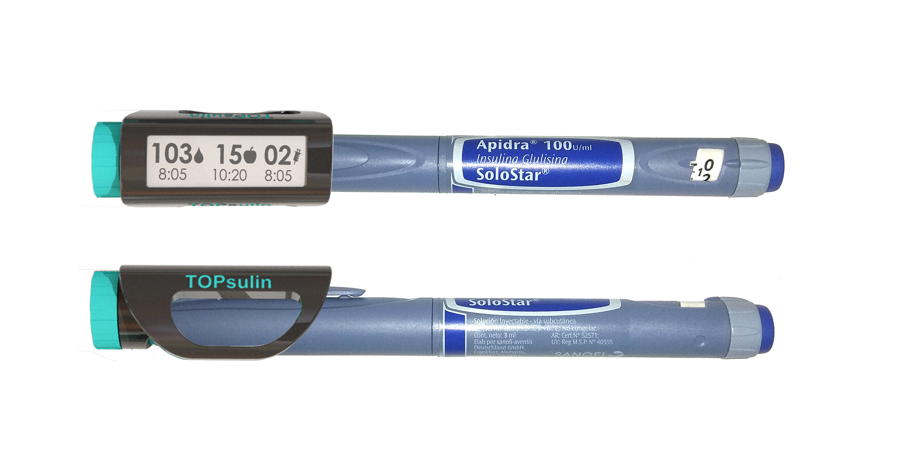
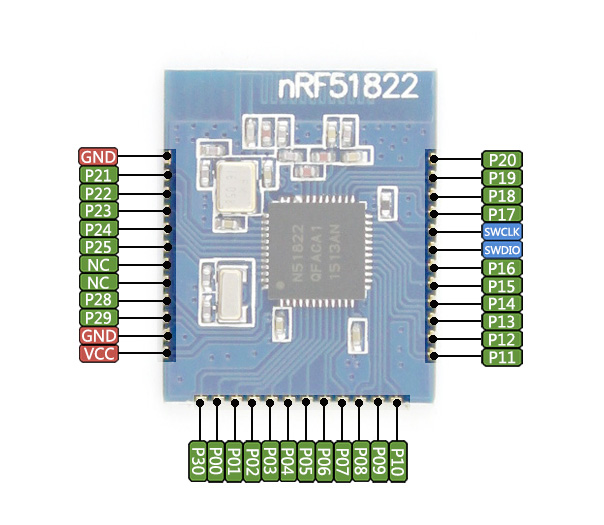

# Topsulin



## Software

### BLE Services and Characteristics

|GATT Services |GATT Characteristics            |Description                              |
|--------------|--------------------------------|-----------------------------------------|
|**Glucose**   |0x1808                          |Servicio estándar para glucómetros       |
|0x2A18        |**Glucose Measurement**         |Valores de glucemia                      |
|0x2A34        |**Glucose Measurement Context** |Información adicional (CHO e insulina)   |
|0x2A51        |**Glucose Feature**             |Información sobre features soportadas    |
|0x2A52        |**Record Access Control Point** |Punto de control de acceso del registro  |
|**Topsulin**  |0xF65D                          |Servicio específico de Topsulin          |
|0xF65E        |**Configuration**               |Configuración de preferencias de usuario |
|0xF65F        |**Name**                        |Nombre para mostrar                      |
|0xF660        |**Time**                        |Fecha y hora                             |
|0xF661        |**Calculator**                  |Parámetros para el calculador de bolos   |
|0xF662        |**Insulin**                     |Tipo, capacidad y cantidad restante      |
|0xF663        |**Device**                      |Información sobre el dispositivo         |

Base UUID para Topsulin Services y Characteristics 0x3419-XXXX-1505-31A7-EC4D-449B-0752-1104

#### Glucose Service

Según el servicio estándar [Glucose Service Specification](https://www.bluetooth.com/specifications/gatt/viewer?attributeXmlFile=org.bluetooth.service.glucose.xml)

```c
/**@brief Glucose feature */
#define BLE_GLS_FEATURE_LOW_BATT                       0x0001  /**< Low Battery Detection During Measurement Supported */
#define BLE_GLS_FEATURE_MALFUNC                        0x0002  /**< Sensor Malfunction Detection Supported */
#define BLE_GLS_FEATURE_SAMPLE_SIZE                    0x0004  /**< Sensor Sample Size Supported */
#define BLE_GLS_FEATURE_INSERT_ERR                     0x0008  /**< Sensor Strip Insertion Error Detection Supported */
#define BLE_GLS_FEATURE_TYPE_ERR                       0x0010  /**< Sensor Strip Type Error Detection Supported */
#define BLE_GLS_FEATURE_RES_HIGH_LOW                   0x0020  /**< Sensor Result High-Low Detection Supported */
#define BLE_GLS_FEATURE_TEMP_HIGH_LOW                  0x0040  /**< Sensor Temperature High-Low Detection Supported */
#define BLE_GLS_FEATURE_READ_INT                       0x0080  /**< Sensor Read Interrupt Detection Supported */
#define BLE_GLS_FEATURE_GENERAL_FAULT                  0x0100  /**< General Device Fault Supported */
#define BLE_GLS_FEATURE_TIME_FAULT                     0x0200  /**< Time Fault Supported */
#define BLE_GLS_FEATURE_MULTI_BOND                     0x0400  /**< Multiple Bond Supported */

/**@brief Glucose measurement flags */
#define BLE_GLS_MEAS_FLAG_TIME_OFFSET                  0x01    /**< Time Offset Present */
#define BLE_GLS_MEAS_FLAG_CONC_TYPE_LOC                0x02    /**< Glucose Concentration, Type, and Sample Location Present */
#define BLE_GLS_MEAS_FLAG_UNITS_KG_L                   0x00    /**< Glucose Concentration Units kg/L */
#define BLE_GLS_MEAS_FLAG_UNITS_MOL_L                  0x04    /**< Glucose Concentration Units mol/L */
#define BLE_GLS_MEAS_FLAG_SENSOR_STATUS                0x08    /**< Sensor Status Annunciation Present */
#define BLE_GLS_MEAS_FLAG_CONTEXT_INFO                 0x10    /**< Context Information Follows */

/**@brief Glucose measurement type */
#define BLE_GLS_MEAS_TYPE_CAP_BLOOD                    1       /**< Capillary whole blood */
#define BLE_GLS_MEAS_TYPE_CAP_PLASMA                   2       /**< Capillary plasma */
#define BLE_GLS_MEAS_TYPE_VEN_BLOOD                    3       /**< Venous whole blood */
#define BLE_GLS_MEAS_TYPE_VEN_PLASMA                   4       /**< Venous plasma */
#define BLE_GLS_MEAS_TYPE_ART_BLOOD                    5       /**< Arterial whole blood */
#define BLE_GLS_MEAS_TYPE_ART_PLASMA                   6       /**< Arterial plasma */
#define BLE_GLS_MEAS_TYPE_UNDET_BLOOD                  7       /**< Undetermined whole blood */
#define BLE_GLS_MEAS_TYPE_UNDET_PLASMA                 8       /**< Undetermined plasma */
#define BLE_GLS_MEAS_TYPE_FLUID                        9       /**< Interstitial fluid (ISF) */
#define BLE_GLS_MEAS_TYPE_CONTROL                      10      /**< Control solution */

/**@brief Glucose measurement location */
#define BLE_GLS_MEAS_LOC_FINGER                        1       /**< Finger */
#define BLE_GLS_MEAS_LOC_AST                           2       /**< Alternate Site Test (AST) */
#define BLE_GLS_MEAS_LOC_EAR                           3       /**< Earlobe */
#define BLE_GLS_MEAS_LOC_CONTROL                       4       /**< Control solution */
#define BLE_GLS_MEAS_LOC_NOT_AVAIL                     15      /**< Sample Location value not available */

/**@brief Glucose sensor status annunciation */
#define BLE_GLS_MEAS_STATUS_BATT_LOW                   0x0001  /**< Device battery low at time of measurement */
#define BLE_GLS_MEAS_STATUS_SENSOR_FAULT               0x0002  /**< Sensor malfunction or faulting at time of measurement */
#define BLE_GLS_MEAS_STATUS_SAMPLE_SIZE                0x0004  /**< Sample size for blood or control solution insufficient at time of measurement */
#define BLE_GLS_MEAS_STATUS_STRIP_INSERT               0x0008  /**< Strip insertion error */
#define BLE_GLS_MEAS_STATUS_STRIP_TYPE                 0x0010  /**< Strip type incorrect for device */
#define BLE_GLS_MEAS_STATUS_RESULT_HIGH                0x0020  /**< Sensor result higher than the device can process */
#define BLE_GLS_MEAS_STATUS_RESULT_LOW                 0x0040  /**< Sensor result lower than the device can process */
#define BLE_GLS_MEAS_STATUS_TEMP_HIGH                  0x0080  /**< Sensor temperature too high for valid test/result at time of measurement */
#define BLE_GLS_MEAS_STATUS_TEMP_LOW                   0x0100  /**< Sensor temperature too low for valid test/result at time of measurement */
#define BLE_GLS_MEAS_STATUS_STRIP_PULL                 0x0200  /**< Sensor read interrupted because strip was pulled too soon at time of measurement */
#define BLE_GLS_MEAS_STATUS_GENERAL_FAULT              0x0400  /**< General device fault has occurred in the sensor */
#define BLE_GLS_MEAS_STATUS_TIME_FAULT                 0x0800  /**< Time fault has occurred in the sensor and time may be inaccurate */

/**@brief Glucose measurement context flags */
#define BLE_GLS_CONTEXT_FLAG_CARB                      0x01    /**< Carbohydrate id and carbohydrate present */
#define BLE_GLS_CONTEXT_FLAG_MEAL                      0x02    /**< Meal present */
#define BLE_GLS_CONTEXT_FLAG_TESTER                    0x04    /**< Tester-health present */
#define BLE_GLS_CONTEXT_FLAG_EXERCISE                  0x08    /**< Exercise duration and exercise intensity present */
#define BLE_GLS_CONTEXT_FLAG_MED                       0x10    /**< Medication ID and medication present */
#define BLE_GLS_CONTEXT_FLAG_MED_KG                    0x00    /**< Medication value units, kilograms */
#define BLE_GLS_CONTEXT_FLAG_MED_L                     0x20    /**< Medication value units, liters */
#define BLE_GLS_CONTEXT_FLAG_HBA1C                     0x40    /**< Hba1c present */
#define BLE_GLS_CONTEXT_FLAG_EXT                       0x80    /**< Extended flags present */

/**@brief Glucose measurement context carbohydrate ID */
#define BLE_GLS_CONTEXT_CARB_BREAKFAST                 1       /**< Breakfast */
#define BLE_GLS_CONTEXT_CARB_LUNCH                     2       /**< Lunch */
#define BLE_GLS_CONTEXT_CARB_DINNER                    3       /**< Dinner */
#define BLE_GLS_CONTEXT_CARB_SNACK                     4       /**< Snack */
#define BLE_GLS_CONTEXT_CARB_DRINK                     5       /**< Drink */
#define BLE_GLS_CONTEXT_CARB_SUPPER                    6       /**< Supper */
#define BLE_GLS_CONTEXT_CARB_BRUNCH                    7       /**< Brunch */

/**@brief Glucose measurement context meal */
#define BLE_GLS_CONTEXT_MEAL_PREPRANDIAL               1       /**< Preprandial (before meal) */
#define BLE_GLS_CONTEXT_MEAL_POSTPRANDIAL              2       /**< Postprandial (after meal) */
#define BLE_GLS_CONTEXT_MEAL_FASTING                   3       /**< Fasting */
#define BLE_GLS_CONTEXT_MEAL_CASUAL                    4       /**< Casual (snacks, drinks, etc.) */
#define BLE_GLS_CONTEXT_MEAL_BEDTIME                   5       /**< Bedtime */

/**@brief Glucose measurement context tester */
#define BLE_GLS_CONTEXT_TESTER_SELF                    1       /**< Self */
#define BLE_GLS_CONTEXT_TESTER_PRO                     2       /**< Health care professional */
#define BLE_GLS_CONTEXT_TESTER_LAB                     3       /**< Lab test */
#define BLE_GLS_CONTEXT_TESTER_NOT_AVAIL               15      /**< Tester value not available */

/**@brief Glucose measurement context health */
#define BLE_GLS_CONTEXT_HEALTH_MINOR                   1       /**< Minor health issues */
#define BLE_GLS_CONTEXT_HEALTH_MAJOR                   2       /**< Major health issues */
#define BLE_GLS_CONTEXT_HEALTH_MENSES                  3       /**< During menses */
#define BLE_GLS_CONTEXT_HEALTH_STRESS                  4       /**< Under stress */
#define BLE_GLS_CONTEXT_HEALTH_NONE                    5       /**< No health issues */
#define BLE_GLS_CONTEXT_HEALTH_NOT_AVAIL               15      /**< Health value not available */

/**@brief Glucose measurement context medication ID */
#define BLE_GLS_CONTEXT_MED_RAPID                      1       /**< Rapid acting insulin */
#define BLE_GLS_CONTEXT_MED_SHORT                      2       /**< Short acting insulin */
#define BLE_GLS_CONTEXT_MED_INTERMED                   3       /**< Intermediate acting insulin */
#define BLE_GLS_CONTEXT_MED_LONG                       4       /**< Long acting insulin */
#define BLE_GLS_CONTEXT_MED_PREMIX                     5       /**< Pre-mixed insulin */

/**@brief SFLOAT format (IEEE-11073 16-bit FLOAT, meaning 4 bits for exponent (base 10) and 12 bits mantissa) */
typedef struct
{
  int8_t exponent;                                             /**< Base 10 exponent, should be using only 4 bits */
  int16_t mantissa;                                            /**< Mantissa, should be using only 12 bits */
} sfloat_t;
```

Los enteros de 16 bits se codifican de manera que el byte más alto va primero. El número 250 en hexadecimal es 0x00FA, sin embargo en BLE se lee el byte 0xFA00.

El sfloat se usa para guardar un número con coma en 16 bits, los primeros 12 bits son la mantisa y los otros 4 el exponente. 

```c
uint16_t encode_sfloat(sfloat_t sf)
{
    uint16_t dec;
    dec = ((sf.exponent << 12) & 0xF000) | ((sf.mantissa <<  0) & 0x0FFF);
    return dec;
}

sfloat_t decode_sfloat(uint16_t u)
{
    sfloat_t sf;
    sf.exponent = (u & 0xF000) >> 12;
    sf.mantissa = (u & 0x0FFF) >> 0;
    return sf;
}
```

#### Topsulin Service

[Characteristic Format Types](https://www.bluetooth.com/specifications/assigned-numbers/format-types)

|Characteristic                                      |Format |Value                              |Default                   |
|----------------------------------------------------|-------|-----------------------------------|--------------------------|
|**Configuration**                                   |       |                                   |0x07FA00                  |
|Registro de glucemia                                |bit0   |0 No, 1 Si                         |Si                        |
|Registro de insulina                                |bit1   |0 No, 1 Si                         |Si                        |
|Registro de CHO                                     |bit2   |0 No, 1 Si                         |Si                        |
|Invertir los colores de la pantalla                 |bit3   |0 Fondo blanco, 1 Fondo negro      |Fondo blanco              |
|Unidades de glucemia                                |bit4   |0 kg/L, 1 mol/L                    |kg/L                      |
|Calculador de bolo                                  |bit5   |0 Desactivado, 1 Activado          |Desactivado               |
|Orientación de pantalla                             |bit6   |0 Diestro, 1 Zurdo                 |Diestro                   |
|Unidades de CHO                                     |bit7   |0 CHO en g, 1 CHO en porciones     |CHO en g                  |
|Equivalencia entre gramos y porciones               |uint16 |Peso en g de una porción           |250 g                     |
|**Name**                                            |       |                                   |0x476C75636F736565        |
|Nombre para mostrar                                 |uint8  |String de largo máximo 20 UTF-8    |Glucose                   |
|**Time**                                            |       |                                   |0xE3070101060120          |
|Hora y fecha del dispositivo                        |time   |[Time Characteristic](https://www.bluetooth.com/specifications/gatt/viewer?attributeXmlFile=org.bluetooth.characteristic.date_time.xml) |01/01/19 12:00:00 |
|**Calculator**                                      |       |                                   |0x3CD096D00F000FD0        |
|Nivel bajo                                          |sfloat |Nivel de glucemia baja en kg/L     |60x10^-3 kg/L             |
|Nivel alto                                          |sfloat |Nivel de glucemia alta en kg/L     |150x10^-3 kg/L            |
|Sensibilidad                                        |uint16 |Cada cuántos CHO en g sumo 1U      |15 g                      |
|Corrección de hiperglucemia                         |sfloat |Cada cuántos kg/L de hiper sumo 1U |15x10^-3 kg/L             |
|**Insulin**                                         |       |                                   |0x012C0178001E0078006801  |
|Tipo de insulina                                    |uint8  |Medication ID from Glucose Service |BLE_GLS_CONTEXT_MED_RAPID |
|Capacidad de la lapicera                            |uint16 |U de insulina en una lapicera nueva|300 U                     |
|Capacidad restante de la lapicera                   |uint16 |U de insulina restantes            |120 U                     |
|Comienzo de acción                                  |uint16 |En minutos                         |30 m                      |
|Acción máxima                                       |uint16 |En minutos                         |120 m                     |
|Duración de la acción                               |uint16 |En minutos                         |360 m                     |
|**Device**                                          |       |                                   |0x010100D90C              |
|Firmware                                            |uint8  |Versión de firmware                |1                         |
|Serial Number                                       |uint16 |Número de serie                    |1                         |
|Battery                                             |uint16 |Voltaje de la batería en mV        |Cerca de 3300 mV          |

## Board



Encoder

|nRF pin|Use  |
|-------|-----|
|01     |A    |
|00     |B    |
|30     |SW   |

Display

|nRF pin|Use  |
|-------|-----|
|21     |MOSI |
|22     |CLK  |
|23     |CS   |
|24     |DC   |
|25     |RST  |
|28     |BUSY |

## SoC

SoC [nRF51822](https://www.nordicsemi.com/eng/nordic/download_resource/62726/14/39584073/13358) QFACA10 (256kB flash, 32 kB RAM)

[INFOCENTER](http://infocenter.nordicsemi.com)

|ID |Base address |Peripheral  |Instance    |Description                                  |Used by           | 
|---|-------------|------------|------------|---------------------------------------------|------------------|
|0  |0x40000000   |POWER       |POWER       |Power Control.                               |SoftDevice        |
|0  |0x40000000   |CLOCK       |CLOCK       |Clock Control.                               |SoftDevice        |
|0  |0x40000000   |MPU         |MPU         |Memory Protection Unit.                      |SoftDevice        |
|1  |0x40001000   |RADIO       |RADIO       |2.4 GHz Radio.                               |SoftDevice        |
|2  |0x40002000   |UART        |UART0       |Universal Asynchronous Receiver/Transmitter. |                  |
|3  |0x40003000   |SPI         |SPI0        |SPI Master.                                  |EPD (SPI)         |
|3  |0x40003000   |TWI         |TWI0        |I2C compatible Two-Wire Interface 0.         |EPD (SPI)         |
|4  |0x40004000   |SPIS        |SPIS1       |SPI Slave.                                   |                  |
|4  |0x40004000   |SPI         |SPI1        |SPI Master.                                  |                  |
|4  |0x40004000   |TWI         |TWI1        |I2C compatible Two-Wire Interface 1.         |                  |
|6  |0x40006000   |GPIOTE      |GPIOTE      |GPIO Task and Events.                        |                  |
|7  |0x40007000   |ADC         |ADC         |Analog to Digital Converter.                 |Battery           |
|8  |0x40008000   |TIMER       |TIMER0      |Timer/Counter 0.                             |SoftDevice        |
|9  |0x40009000   |TIMER       |TIMER1      |Timer/Counter 1.                             |                  |
|10 |0x4000A000   |TIMER       |TIMER2      |Timer/Counter 2.                             |                  |
|11 |0x4000B000   |RTC         |RTC0        |Real Time Counter 0.                         |SoftDevice        |
|12 |0x4000C000   |TEMP        |TEMP        |Temperature Sensor.                          |SoftDevice        |
|13 |0x4000D000   |RNG         |RNG         |Random Number Generator.                     |SoftDevice        |
|14 |0x4000E000   |ECB         |ECB         |Crypto AES ECB.                              |SoftDevice        |
|15 |0x4000F000   |CCM         |CCM         |AES Crypto CCM.                              |SoftDevice        |
|15 |0x4000F000   |AAR         |AAR         |Accelerated Address Resolver.                |SoftDevice        |
|16 |0x40010000   |WDT         |WDT         |Watchdog Timer.                              |                  |
|17 |0x40011000   |RTC         |RTC1        |Real Time Counter 1.                         |Timer library     |
|18 |0x40012000   |QDEC        |QDEC        |Quadrature Decoder.                          |                  |
|19 |0x40013000   |LPCOMP      |LPCOMP      |Low Power Comparator.                        |                  |
|20 |0x40014000   |SWI         |SWI0        |Software interrupt.                          |Timer library     |
|21 |0x40015000   |SWI         |SWI1        |Software interrupt.                          |SoftDevice        |
|22 |0x40016000   |SWI         |SWI2        |Software interrupt                           |SoftDevice        |
|23 |0x40017000   |SWI         |SWI3        |Software interrupt.                          |                  |
|24 |0x40018000   |SWI         |SWI4        |Software interrupt.                          |SoftDevice        |
|25 |0x40019000   |SWI         |SWI5        |Software interrupt.                          |SoftDevice        |
|30 |0x4001E000   |NVMC        |NVMC        |Non-Volatile Memory Controller.              |SoftDevice        |
|31 |0x4001F000   |PPI         |PPI         |Programmable Peripheral Interconnect.        |                  |
|NA |0x50000000   |GPIO        |GPIO        |General Purpose Input and Output.            |GPIO              |
|NA |0x10000000   |FICR        |FICR        |Factory Information Configuration Registers. |SoftDevice        |
|NA |0x10001000   |UICR        |UICR        |User Information Configuration Registers.    |SoftDevice        |
